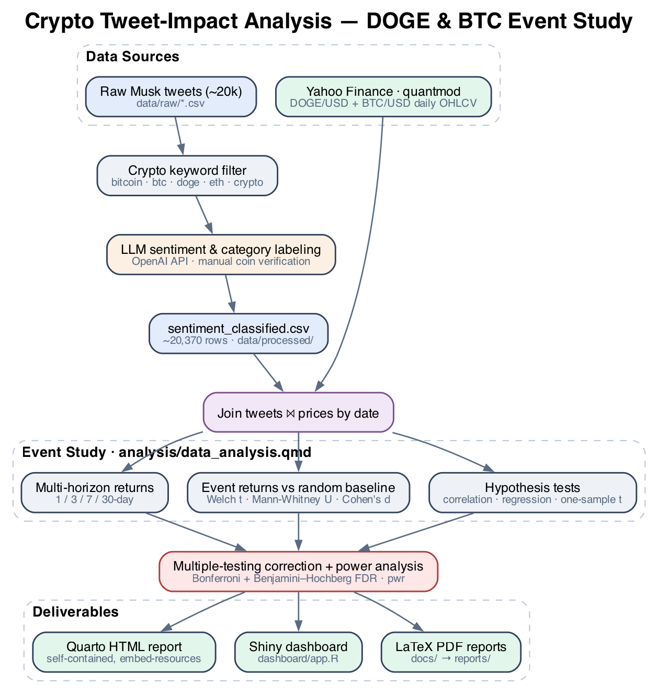

# Do Elon Musk's Tweets Move Crypto? An Event-Study of DOGE & BTC

> A reproducible, statistically rigorous study of whether Elon Musk's
> cryptocurrency tweets are associated with subsequent price movements in
> Dogecoin (DOGE/USD) and Bitcoin (BTC/USD).


This project pairs ~20,000 LLM-classified Musk tweets with daily crypto prices
and asks a deceptively simple question — *does the tweet move the coin?* — then
answers it with an **event-study framework** and a level of statistical hygiene
(multiple-testing correction, effect sizes, power analysis) that most "tweet vs.
price" analyses skip. The headline result is a lesson in itself: most signals
that look significant **disappear once you correct for multiple comparisons.**

---

## Table of Contents
- [Key Findings](#key-findings)
- [Why This Project Is Interesting](#why-this-project-is-interesting)
- [Technologies](#technologies)
- [Architecture & Methodology](#architecture--methodology)
- [Repository Structure](#repository-structure)
- [Setup](#setup)
- [Usage](#usage)
- [Limitations](#limitations)
- [Authors](#authors)

---

## Key Findings

| # | Question | Result |
|---|----------|--------|
| 1 | Does sentiment predict **next-day** returns? | No meaningful effect for either coin (BTC: r ≈ 0.12, p = 0.22; DOGE: r ≈ −0.12, p = 0.38). |
| 2 | Do **negative-sentiment** DOGE tweets precede declines? | **The opposite** — a *contrarian* signal: mean +4.27% 7-day return (p = 0.0097, 95% CI [1.1%, 7.4%]). |
| 3 | Do **meme** vs **"relevant"** tweets behave differently? | Strongly: meme DOGE tweets averaged **+6.9%** over 7 days while "relevant" ones averaged **−6.2%**. |
| 4 | Does tweet **volume** drive volatility? | Tentative positive trend, but **not statistically significant** (BTC p ≈ 0.15). |
| 5 | What survives **multiple-testing correction**? | Almost nothing. Most raw-significant signals fail Bonferroni/FDR — statistical ≠ practical significance. |

> The most defensible takeaway is methodological: with only ~58 verified Doge
> tweets, **statistical power is low**, and rigorous correction is essential to
> avoid false discoveries. The analysis is transparent about this throughout.

---

## Why This Project Is Interesting

This is a data-science project that takes **inference seriously** rather than
stopping at a correlation and a scatter plot:

- **Event-study design** with a randomized baseline control group (seeded for
  reproducibility) instead of naive before/after comparisons.
- **Multiple-testing correction** (Bonferroni *and* Benjamini-Hochberg FDR)
  across 30+ category tests — the difference between a real finding and noise.
- **Effect sizes + confidence intervals** (Cohen's d) reported alongside every
  p-value, and an explicit **statistical-vs-practical significance** discussion.
- **Power analysis** (`pwr`) quantifying what the small sample *can* and *cannot*
  detect, with minimum-detectable-effect estimates.
- **LLM-in-the-loop labeling**: ~20k tweets scored for sentiment and classified
  (relevant vs. meme, topic category) via the OpenAI API, with manual
  verification of the primary coins.
- **End-to-end reproducibility**: price data auto-downloads from Yahoo Finance if
  missing, random seeds are fixed, and the report renders to a single
  self-contained HTML file.

---

## Technologies

| Area | Tools |
|------|-------|
| Language | **R 4.x** |
| Data wrangling | `tidyverse` (dplyr, tidyr, readr, stringr, purrr), `lubridate` |
| Modeling & stats | `broom`, `tseries`, base `stats` (t-tests, Wilcoxon, lm, cor), `pwr` (power analysis) |
| Market data | `quantmod` (Yahoo Finance) |
| Reporting | **Quarto**, `knitr`, `kableExtra` |
| Interactive app | **Shiny**, `ggplot2` |
| Sentiment labeling | OpenAI API (offline pipeline; outputs shipped in `data/processed/`) |
| Tooling | GNU Make, Git |

---

## Architecture & Methodology



<details>
<summary>Text version of the pipeline</summary>

```
   Raw Musk tweets (~20k)                Yahoo Finance (quantmod)
   data/raw/*.csv                        DOGE/USD + BTC/USD daily OHLCV
        │                                         │
        ▼                                         │
  Keyword filter ──► LLM sentiment & ──► sentiment_classified.csv
                     category labeling   (data/processed/)
        │                                         │
        └──────────────┬──────────────────────────┘
                       ▼
         Join tweets ⨝ prices by date
                       │
        ┌──────────────┼─────────────────────────────┐
        ▼              ▼                               ▼
  Multi-horizon   Event-study returns vs        Hypothesis tests
  returns (1/7/   random baseline control     (correlation, regression,
  30-day)         (Welch t, Mann-Whitney,      one-sample t, R² by horizon)
                  Cohen's d)                           │
        └──────────────┴───────────────┬───────────────┘
                                        ▼
              Multiple-testing correction (Bonferroni + FDR)
                          + power analysis
                                        ▼
        ┌───────────────────────────────┬───────────────────────────┐
        ▼                               ▼                           ▼
  Quarto HTML report          Shiny tweet-effects          LaTeX PDF reports
  (analysis/data_analysis.qmd)  dashboard (dashboard/app.R)   (docs/ → reports/)
```

</details>

> The diagram is generated from [`reports/figures/architecture.gv`](reports/figures/architecture.gv)
> with Graphviz: `dot -Tpng -Gdpi=150 reports/figures/architecture.gv -o reports/figures/architecture.png`.

**Analytical pipeline (in `analysis/data_analysis.qmd`):**

1. **Ingest** — load tweets + prices; auto-fetch prices from Yahoo Finance if
   absent.
2. **Clean & filter** — relevant, non-meme, valid-sentiment tweets per coin;
   de-duplicate; bucket sentiment (low/medium/high).
3. **Feature-engineer** — percentage returns at 1-, 3-, 7-, and 30-day horizons.
4. **Event study** — compute tweet-event returns and a seeded random baseline.
5. **Test** — Welch t-tests + Mann-Whitney U vs baseline; one-sample t-tests for
   negative-sentiment events; correlation & multiple regression of returns on
   sentiment and volume.
6. **Correct & quantify** — Bonferroni + FDR adjustment; Cohen's d with CIs;
   power and minimum-detectable-effect analysis.
7. **Report** — narrative interpretation, summary tables, and visualizations.

---

## Repository Structure

A condensed view (full details in **[PROJECT_STRUCTURE.md](PROJECT_STRUCTURE.md)**):

```
analysis/data_analysis.qmd   ★ main DOGE + BTC event study (Quarto)
dashboard/app.R              standalone Shiny tweet-effects dashboard
data/processed/              analysis-ready datasets (committed)
data/raw/                    large source scrapes (git-ignored)
reports/                     compiled PDF reports + figures
docs/                        LaTeX sources
scripts/install_dependencies.R   one-shot dependency installer
Makefile                     make deps | report | dashboard | clean
```

---

## Setup

**Prerequisites:** R ≥ 4.0, and (to render the report) the
[Quarto CLI](https://quarto.org/docs/get-started/). For the PDF reports you also
need a LaTeX distribution (e.g. TinyTeX or MacTeX).

```bash
# 1. Clone
git clone <your-fork-url> crypto-tweet-impact-analysis
cd crypto-tweet-impact-analysis

# 2. Install R dependencies
make deps          # or: Rscript scripts/install_dependencies.R
```

The committed datasets in `data/processed/` are enough to reproduce the full
statistical analysis. Price data will also auto-download from Yahoo Finance if
ever missing (requires network access). The large raw scrapes in `data/raw/` are
git-ignored — see [`data/README.md`](data/README.md) for how to obtain them
(only needed for tweet-text display in the dashboard).

---

## Usage

```bash
# Render the full analysis to a self-contained HTML report
make report        # → analysis/data_analysis.html

# Launch the interactive Shiny dashboard
make dashboard     # opens in your browser

# (Re)compile the LaTeX reports to PDF
make reports-pdf

# Remove build artifacts
make clean
```

Prefer RStudio? Open `crypto-tweet-impact-analysis.Rproj`, then render
`analysis/data_analysis.qmd` or run `dashboard/app.R`.

---

## Limitations

The analysis is candid about its constraints — a feature, not a bug:

- **Small verified sample** (~58 Doge tweets) ⇒ limited statistical power.
- **Observational design** ⇒ associations, not causation; many confounders.
- **Temporal dependence** is not fully modeled (no formal time-series model).
- **Random baseline** does not perfectly match market conditions at tweet times.

Each is discussed in the report's *Limitations* and *Future Directions*
sections, with concrete suggestions (larger samples, matched baselines,
time-series methods, causal inference).

---

## Authors

CSP 571 — Data Preparation & Analysis, Illinois Institute of Technology.

- **Madhu Siddharth Suthagar**
- John Chmura
- Akash Chenchugan
- Harish Namasivayam Muthuswamy
- Yogesh Periyasamy

Released under the [MIT License](LICENSE).
